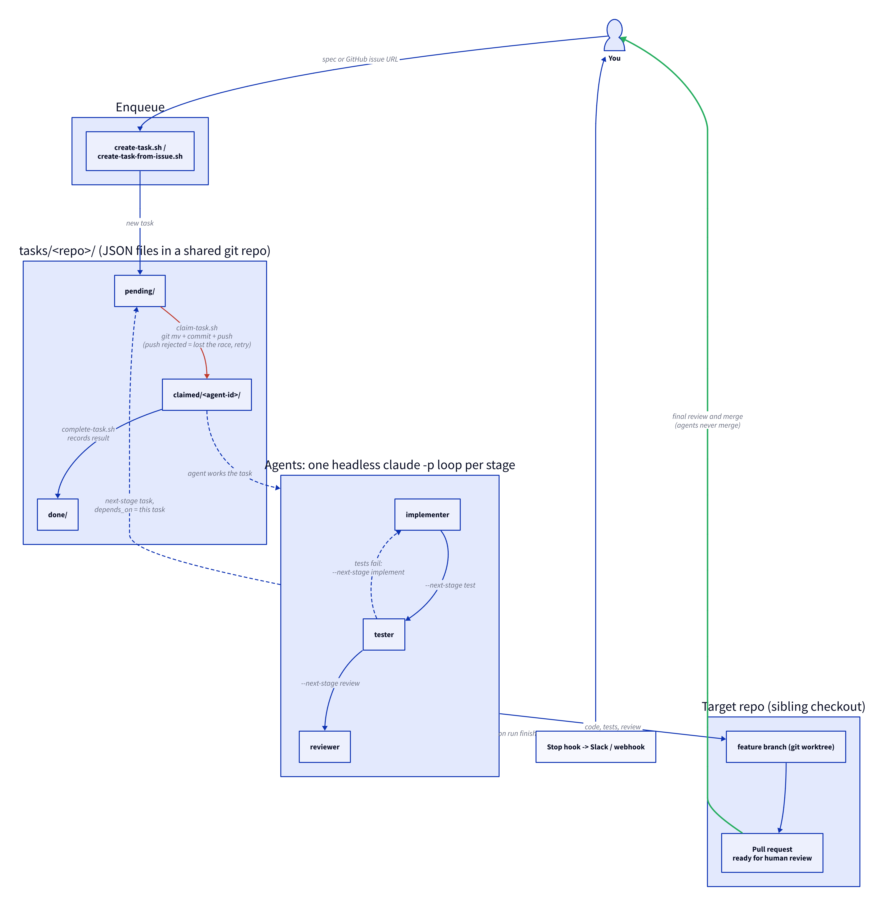

# agent-tasks

A phase-1, git-flat-file task queue for running multiple Claude Code agents
as a pipeline (spec → implement → test → review) without you relaying work
between them by hand.

## Why this exists

**The problem.** Once you're running more than one Claude Code agent, *you*
become the message bus. One agent finishes an implementation; you copy the
branch name and context into a second session to get it tested; the tester
finds a failure; you carry that back to the first agent; then you shepherd
the result to a reviewer. Each hop needs you awake, at your keyboard, and
holding the whole picture in your head. The agents are fast; the handoffs
are the bottleneck, and they're the boring part of the job.

**What this changes for you.** You write down what you want (a spec, or just
a GitHub issue URL) and walk away. Agents pick up the work, hand it to each
other, send it backwards when tests fail, and stop at a ready-for-review pull
request. Your involvement collapses to two moments: deciding what should be
built, and doing the final human review. Everything in between is fully
autonomous, including overnight and while you're on another machine.

Concretely, that means:

- **No relaying.** Handoffs happen through `complete-task.sh --next-stage`,
  not through you pasting context between terminals.
- **Failures loop back on their own.** A tester or reviewer can send work
  back to the implement stage without a human noticing first.
- **Cheap to leave running.** Each loop only spends a `claude -p` call when
  there's actually a pending task for it; idle polling costs nothing.
- **Nothing gets past you.** Agents never merge. The pipeline ends at a PR
  marked ready for human review.
- **You can always see what's going on.** `scripts/list-tasks.sh` shows the
  whole queue, and every task file carries its own history of who did what
  and when.

**Why not an existing tool?** Before building this we looked around for
something that already did this job, and nothing fit, including using Jira
as the coordination point. The gap is that existing task trackers are built
for humans as the workers: they assume someone reads a ticket, drags it
across a board, and updates it by hand. What this needed was different:

- an **atomic claim**, so two agents never grab the same task;
- **machine-checkable dependencies**, so a test task isn't claimable until
  its implement task is done;
- **agents as first-class actors** that can enqueue, claim, complete, and
  reroute work on their own, from a headless process;
- **no server, and no API credentials handed to unattended agents**, so the
  whole coordination layer is a git repo you already know how to host,
  back up, and audit.

Git gives us the atomic claim for free (a rejected push means someone else
won), plain JSON files give us a queue anyone can read or grep, and the
history is the audit log. That's why the whole thing is a few short bash
scripts rather than a service.

## How it works



The diagram is generated from [`docs/architecture.d2`](docs/architecture.d2).
GitHub doesn't render [D2](https://d2lang.com) natively, so the PNG is
committed alongside the source. After editing the `.d2` file, regenerate it:

```
d2 --layout=dagre --pad 40 docs/architecture.d2 docs/architecture.png
```

1. **Enqueue.** You (or an agent) run `create-task.sh` or
   `create-task-from-issue.sh`, which drops a JSON file in
   `tasks/<repo>/pending/`.
2. **Claim.** A loop polls the queue. When it sees work, it launches a
   headless `claude -p` run, which calls `claim-task.sh`. That does a
   `git mv` into `claimed/<agent-id>/`, commits, and pushes. Only one push
   can win; the loser pulls, sees the task is gone, and picks another.
3. **Work.** The agent does its stage's job in a git worktree of the target
   repo, following its role file in `.claude/agents/`.
4. **Complete and chain.** `complete-task.sh` moves the task to `done/`,
   records the result, and can enqueue the next stage with a `depends_on`
   pointing back at it. Tests pass, work moves to review; tests fail, it goes
   back to implement.
5. **Hand off to you.** The reviewer opens the PR and stops. You review and
   merge.

## How it works, in one paragraph

Tasks are JSON files under tasks are JSON files under
`tasks/<repo>/{pending,claimed,done}/`. Claiming a task is a `git mv` into
`claimed/<agent-id>/` followed by a commit and push; if two agents race for
the same task, only one push lands as a fast-forward, and the loser pulls,
sees the file is already gone, and moves on. That push-rejection is the
entire concurrency control — no database, no lock server. Completing a task
moves it into `done/` and can automatically enqueue the next pipeline stage.

This is a starting scaffold, not a hardened library — read the scripts
(they're short) before trusting them with real work, and see "When to
graduate off this" below for the ceiling on this approach.

## Layout

```
agent-tasks/
  tasks/
    <repo-name>/
      pending/<task-id>.json
      claimed/<agent-id>/<task-id>.json
      done/<task-id>.json
  docs/architecture.d2         # architecture diagram (D2 source)
  docs/architecture.png        # rendered diagram, embedded in this README
  schema/task.schema.json      # what a task JSON looks like
  scripts/
    lib.sh                     # shared helpers (sourced, not run directly)
    create-task.sh              # enqueue a task
    create-task-from-issue.sh    # enqueue a task from a GitHub issue URL (via gh)
    claim-task.sh                # atomically claim one eligible task
    complete-task.sh             # finish a task, optionally enqueue the next stage
    list-tasks.sh                 # status view across the queue
    run-agent-loop.sh            # unattended poller for cron/systemd
    notify-webhook.sh            # optional Slack/webhook ping on completion
  .claude/
    agents/implementer.md, tester.md, reviewer.md   # example pipeline roles
    settings.json                                     # Stop hook -> notify-webhook.sh
```

One `example-repo/` skeleton is included under `tasks/` so the directory
structure exists in git (git doesn't track empty dirs) — copy that pattern
for each real repo you want to run a pipeline against.

## Setup

1. **Push this repo somewhere all your machines can reach.** It doesn't need
   to be GitHub — a bare repo on any server you control works fine, e.g.:
   ```
   ssh yourserver 'git init --bare /srv/git/agent-tasks.git'
   git remote add origin yourserver:/srv/git/agent-tasks.git
   git push -u origin main
   ```
2. **Lay out target repos as siblings of this checkout**, e.g.
   `~/work/agent-tasks`, `~/work/example-repo`, `~/work/another-repo` — the
   example subagents assume they can `cd ../<target-repo>` and
   `git worktree add` from there. This matches a normal multi-repo layout.
3. **Make sure `jq` and `git` are installed** wherever agents will run
   (`which jq git`).
4. **Add a `tasks/<repo-name>/{pending,claimed,done}` skeleton** for each
   real repo (copy `tasks/example-repo/`, or just run `create-task.sh` once —
   it creates `pending/` for you).
5. **Copy `.claude/agents/*.md` into each target repo's own `.claude/agents/`**
   (or point Claude Code at this repo's `.claude/` via `--add-dir` — your
   call). Adjust the `tools:` allowlist per role before running unattended;
   the shipped examples are deliberately narrow (no arbitrary network access,
   reviewer can't push/merge).
6. **Do the first cycle by hand** before automating anything:
   ```
   scripts/create-task.sh example-repo implement "Add health endpoint" \
     --payload '{"spec":"Add GET /health returning 200 OK"}' \
     --branch feature/health-endpoint
   scripts/claim-task.sh implementer-1 --stage implement --repo example-repo
   # ... do the work yourself, or run: claude --agent implementer -p "..."
   scripts/complete-task.sh <claimed-path> implementer-1 \
     --result '{"commit":"<sha>"}' --next-stage test
   scripts/list-tasks.sh
   ```
   Confirm the `test` task showed up with `depends_on` pointing at the task
   you just finished, and that `list-tasks.sh` shows the right states, before
   you let anything run unattended.
7. **Automate one stage at a time.** For each (subagent, stage, repo) you
   want running unattended:
   ```
   nohup scripts/run-agent-loop.sh implementer implement example-repo 60 &
   ```
   or, better, a systemd unit per instance (`systemctl --user enable
   --now agent-loop@implementer-implement-example-repo`) so it survives
   reboots and you get logs via `journalctl`. `run-agent-loop.sh` polls,
   and only spends a `claude -p` call when there's actually a pending task
   for it — it doesn't burn tokens polling.
8. **(Optional) Set `AGENT_TASKS_WEBHOOK_URL`** in the environment the loop
   runs under to get a ping (Slack-compatible webhook) whenever a headless
   run finishes.

## Creating a task from a GitHub issue

If the work is already tracked as a GitHub issue, skip writing a spec by hand:

```
scripts/create-task-from-issue.sh https://github.com/octocat/example-repo/issues/7
```

This shells out to `gh api repos/<owner>/<repo>/issues/<number>` (REST, not
`gh issue view --json`, which is GraphQL-backed — some corporate proxies
allow REST but block GitHub's GraphQL endpoint, so REST is the more portable
choice here) and freezes the issue's title, body, url, and labels into the
task's `payload` at creation time. The claiming agent then doesn't need `gh`
or network access to GitHub at all, and the task file stays a true record of
what was asked even if the issue is edited afterwards. Requires `gh auth
status` to already be logged in, and assumes your local `tasks/<repo>/`
directory name matches the GitHub repo name.

Stage defaults to `implement`; pass one explicitly, and anything after it
forwards straight through to `create-task.sh` to override the branch name,
priority, etc.:

```
scripts/create-task-from-issue.sh https://github.com/octocat/example-repo/issues/7 \
  review --priority 1 --branch fix/issue-7
```

## The state machine

`pending` → `claimed/<agent>` → `done` (or `failed`, same directory, check
the `status` field). `complete-task.sh --next-stage X` creates a new
`pending` task in stage X with `depends_on: [this-task-id]`, so it's only
claimable once this one shows up under `done/`. A tester or reviewer that
finds a problem can send work backwards with the same flag
(`--next-stage implement`), which is how the pipeline handles failure
without a human relaying "go fix this."

`scripts/list-tasks.sh [repo] [status]` is your dashboard — run it anytime
to see the whole queue's state. There's no daemon required to view it, it's
just files.

### Reserving a task for one agent

By default any agent-id matching `--stage`/`--repo` can claim a task —
first push wins. To guarantee a specific tool or identity handles a stage
(e.g. "the PR review for this one must go to a particular reviewer, not
whichever loop happens to poll first"), set `preferred_agent`:

```
scripts/create-task.sh example-repo review "Review the auth PR" \
  --preferred-agent security-reviewer-bot

# or, chaining off a finished stage:
scripts/complete-task.sh <claimed-task-path> <agent-id> \
  --next-stage review --next-preferred-agent security-reviewer-bot
```

`claim-task.sh` skips any task whose `preferred_agent` doesn't exactly
match the `--agent-id` it's called with (case-sensitive) — a mismatch
prints "no eligible pending task found," not an error, so double-check the
id if a reserved task seems stuck. An unset/empty `preferred_agent` means
any agent may claim it, same as before this field existed.

## Upgrading a seeded copy

Once you've cloned this somewhere and started running pipelines, that copy
holds two kinds of thing: the **framework** (`scripts/`, `schema/`,
`.claude/agents/`, `README.md`, `LICENSE`, `.gitignore`) and **your queue
data** (`tasks/<repo>/{pending,claimed,done}/` and the claim/complete history
in git). Upgrading means pulling new framework files without touching the
queue.

One-time, in your copy:

```
git remote add upstream <this-repo-url>
git fetch upstream --tags
```

Then for each upgrade, pin to a tag (not `upstream/main`) so it's
deterministic and reviewable:

```
git fetch upstream --tags

# what actually changed in the framework, not your queue:
git diff HEAD v0.1.0 -- scripts schema .claude/agents README.md LICENSE .gitignore

# take upstream's version of just those paths:
git checkout v0.1.0 -- scripts schema .claude/agents README.md LICENSE .gitignore
git commit -m "upgrade agent-tasks scaffold to v0.1.0"
```

`tasks/` is never in that path list, so nothing under it — pending JSON,
in-flight claims, `done/` records — is disturbed. New script files are added;
existing ones are updated in place.

Caveats:

- **Local customizations in the listed paths get overwritten.** If you've
  narrowed a role's `tools:` in `.claude/agents/*.md` or edited
  `.claude/settings.json`, read the `git diff` first and re-apply your
  changes after the checkout. Better: keep per-role tweaks in the *target*
  repo's own `.claude/agents/`, where scaffold upgrades can't reach them.
- **Upstream deletions don't propagate.** `git checkout <tag> -- <path>`
  only adds or updates files that exist at that tag; it never deletes. Your
  `tasks/<repo>/` skeletons stay put regardless of what upstream removes.

## Safety notes

- `run-agent-loop.sh` runs Claude Code with `--permission-mode acceptEdits`,
  meaning it edits files and runs commands without asking anyone. That's the
  point of "unattended," but it also means the `.claude/agents/*.md`
  `tools:` allowlists are your actual safety boundary, not a human watching.
  Keep them narrow per role (the reviewer role, for instance, has no reason
  to hold write access to the target repo).
- Nothing here merges to a protected branch or pushes to `main` on its own —
  the reviewer role stops at "ready for human," deliberately. Don't remove
  that guardrail without thinking about it.
- Put `tasks/` on its own branch (or in its own repo, which this already is)
  rather than mixed into a product repo's `main` — otherwise every claim/
  complete commit shows up in that repo's history and can trigger its CI.

## When to graduate off this

This scales to roughly a handful of agents claiming every so often. You'll
know you've outgrown it when:

- You're seeing `push rejected, retrying` often enough that agents are
  burning real time on retries (claim contention).
- You want to query the queue ("everything blocked on the reviewer,
  priority > 2") instead of grepping JSON files.
- The tasks repo's git history is growing fast enough to be annoying.

At that point, the natural next step (discussed separately) is a small
Postgres-backed MCP server exposing `claim_task` / `report_result` /
`list_ready_tasks` — the `task.schema.json` fields here were chosen to map
cleanly onto DB columns, so that migration is a rewrite of the four scripts
in `scripts/`, not a redesign of the task shape or the `.claude/agents/*.md`
roles that use them.
